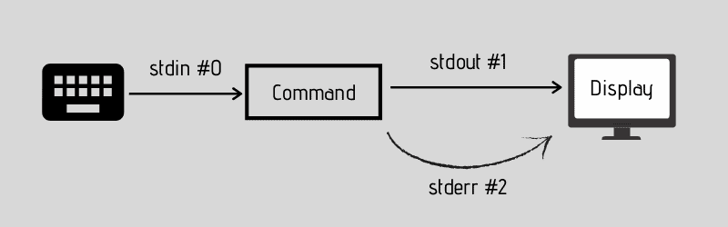
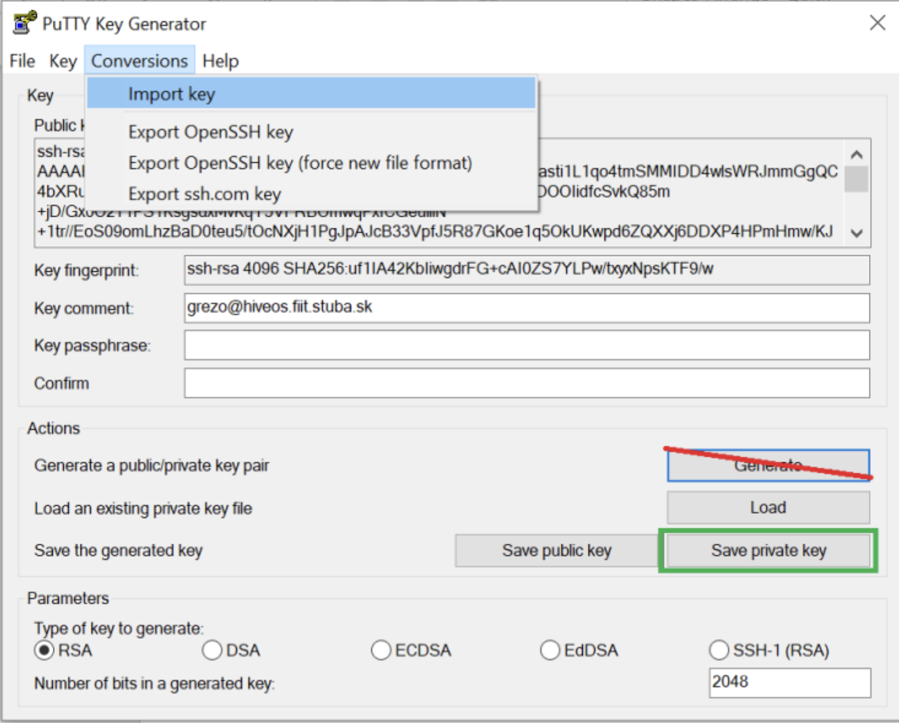

# SSH: Guide to Fast and Secure Remote Access

> **Note:** In this guide, you’ll learn how to set up and use SSH keys to make remote access to your server.

Have you ever wondered if there’s another way to access your GitHub repo? Or what other authentication methods are out there? Maybe you’ve felt frustrated when a system refuses to recognize you, asking those so-called credentials before letting you in. If you already know the answer, this guide isn’t for you. But if not, carry on, good student! 

## What is SSH?
**Secure Shell (SSH)** is a cryptographic network protocol used for securely operating network services over an unsecured network. it relies on public-key cryptography (see diagram below).. 


## What Are SSH Keys?

**SSH keys** are cryptographic credentials that allow you to access remote systems securely without the need to remember your complex passwords. Instead you just create a pair of keys – one public and one private.

Imagine your public key as a padlock you can hand out to any server you’d like to access. Your private key is the only key that can open those padlocks. When you connect, the server checks that your private key fits the public padlock it has stored. If they match, you’re let in—no password needed.

The public key cannot be used to figure out your private key because it’s generated through a one-way mathematical function which makes the system highly secure. Your private key must remain secret and should stay on your computer—never share it with anyone.



SSH keys are widely supported and work with almost any system that uses SSH, including Linux servers, cloud platforms, and code hosting services like GitHub and GitLab.

## How to Generate SSH Keys

Creating SSH keys is a lightning-fast process—done in almost no time, no matter your operating system. It generates two files: a private key (which must stay safe on your computer) and a public key (which you’ll share with the servers you want to access).

### Linux/MacOS 🐧🍺

> **Note:** On Linux & macOS → keys are stored in ~/.ssh/


To create SSH keys on Linux or MacOS, you'll use the built-in ssh-keygen command. let' do it, open your terminal and type:


**ED25519 (Recommended):**
```bash
ssh-keygen -t ed25519 -b 4096 -f ~/.ssh/key_name -C "note-$(date +%Y%m%d)" -N "your password"
```

**RSA (Alternative):**
```bash
ssh-keygen -t rsa -b 4096 -f ~/.ssh/key_name -C "note-$(date +%Y%m%d)" -N "your password"
```

**Flag Explanations:**
- `-t`: Specifies the key algorithm (ed25519 or rsa)
- `-b 4096`: Sets key size to 4096 bits for maximum security
- `-f ~/.ssh/key_name`: Specifies custom file location and name
- `-C "note-$(date +%Y%m%d)"`: Adds a comment with current date for identification
- `-N "your password"`: Sets the passphrase directly (replace with your actual password)

**About the Algorithms:**
- **ED25519**: Modern, faster, and more secure algorithm. Recommended for new keys.
- **RSA**: Widely compatible with older systems, battle-tested and reliable.

These commands create highly secure keys with 4096-bit encryption and automatically add a date-based comment for identification. The **passphrase** adds an extra layer of security, even if someone gets your private key file, they can't use it without knowing this phrase.

### Windows 🪟 🤮

> **Note:** On Windows (with OpenSSH or Git Bash) → they also go under C:\Users\<YourName>\.ssh\

Windows offers several approaches for SSH key generation, each with its own advantages:
- **Git Bash (Recommended for simplicity):**
If Git for Windows is installed, Git Bash provides a Unix-like terminal experience. Simply open Git Bash and execute the same ssh-keygen commands shown in the Linux/MacOS section above.

- **Windows Subsystem for Linux (WSL):**
For developers who prefer authentic Linux environments, WSL delivers native Linux functionality within Windows. All SSH commands function identically to standard Linux systems, making this ideal for cross-platform development workflows.

- **PuTTYgen (GUI Alternative):**
Users who favor graphical interfaces can utilize PuTTYgen, which provides point-and-click SSH key generation with visual configuration options.




# SSH Keys Explained: Guide to Fast and Secure Remote Access

> **Note:** This complete guide shows you how to set up, use, and manage SSH keys for faster and more secure remote access to any system.

## What is SSH?

**Secure Shell (SSH)** is a cryptographic network protocol used for securely operating network services over an unsecured network. It relies on public-key cryptography (see diagram below).


## What Are SSH Keys?

**SSH keys** are cryptographic credentials that enable secure access to remote systems without requiring complex passwords. They work through a matched pair of keys: one public and one private.

Think of your public key as a padlock that you can freely share with any server you want to access. Your private key functions like the unique key that unlocks those padlocks. During connection, the remote system verifies that your private key corresponds to its stored public key. If the keys match, you gain immediate access without password authentication.

## 🔑 How to Generate SSH Keys

### 🍺 Linux/MacOS

**ED25519 (Recommended):**
```bash
ssh-keygen -t ed25519 -b 4096 -f ~/.ssh/key_name -C "note-$(date +%Y%m%d)" -N "your password"
```

**RSA (Alternative):**
```bash
ssh-keygen -t rsa -b 4096 -f ~/.ssh/key_name -C "note-$(date +%Y%m%d)" -N "your password"
```

**Flag Explanations:**
- `-t`: Specifies the key algorithm (ed25519 or rsa)
- `-b 4096`: Sets key size to 4096 bits for maximum security
- `-f ~/.ssh/key_name`: Specifies custom file location and name
- `-C "note-$(date +%Y%m%d)"`: Adds a comment with current date for identification
- `-N "your password"`: Sets the passphrase directly (replace with your actual password)

**About the Algorithms:**
- **ED25519**: Modern, faster, and more secure algorithm. Recommended for new keys.
- **RSA**: Widely compatible with older systems, battle-tested and reliable.

These commands create highly secure keys with 4096-bit encryption and automatically add a date-based comment for identification. The **passphrase** adds an extra layer of security - even if someone gets your private key file, they can't use it without knowing this phrase.

### 🤮 Windows

Windows offers several approaches for SSH key generation, each with its own advantages:

**Git Bash (Recommended for simplicity):**
If Git for Windows is installed, Git Bash provides a Unix-like terminal experience. Simply open Git Bash and execute the same `ssh-keygen` commands shown in the Linux/MacOS section above.

**Windows Subsystem for Linux (WSL):**
For developers who prefer authentic Linux environments, WSL delivers native Linux functionality within Windows. All SSH commands function identically to standard Linux systems, making this ideal for cross-platform development workflows.

**PuTTYgen (GUI Alternative):**
Users who favor graphical interfaces can utilize PuTTYgen, which provides point-and-click SSH key generation with visual configuration options.

Choose the method that best aligns with your workflow and comfort level.


## How to Login using SSH

```bash
ssh root@hiveos.fiit.stuba.sk -p <port> -i <key>
```

Parameter details:

- port: Your assigned port number (provided in email)
- key: Path to your private key file (provided in email)


## Configuring SSH for key authentication

To edit the SSH server configuration, open the main config file, which is located at: 

```bash
vim /etc/ssh/sshd_config
```

In this file, you can disable direct root login via SSH. This forces users to log in with their personal accounts and use sudo for administrative tasks.

**Edit the SSH configuration file:**
```bash
sudo nano /etc/ssh/sshd_config
```

**Find and modify this line:**
```bash
# Change this line from:
#PermitRootLogin yes

# To:
PermitRootLogin no
```

**Restart the SSH service to apply changes:**
```bash
sudo systemctl restart sshd
```


